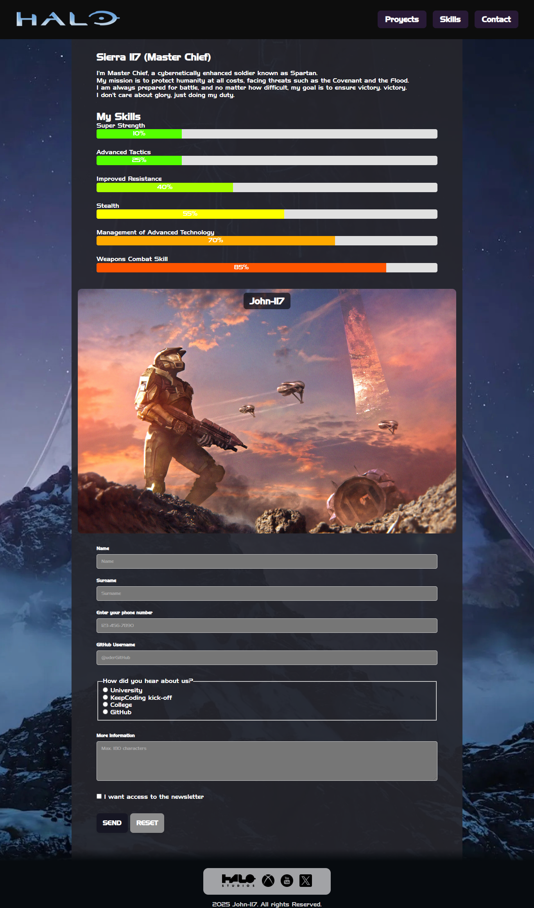
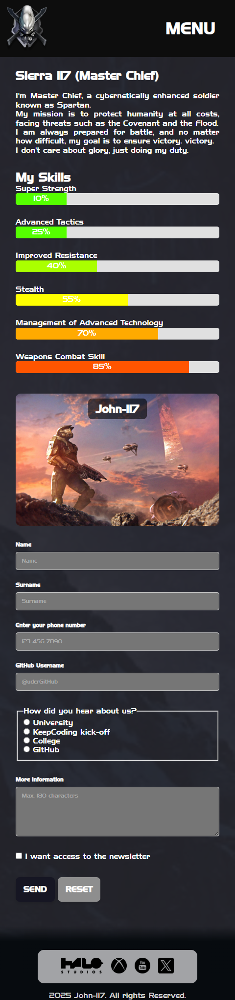
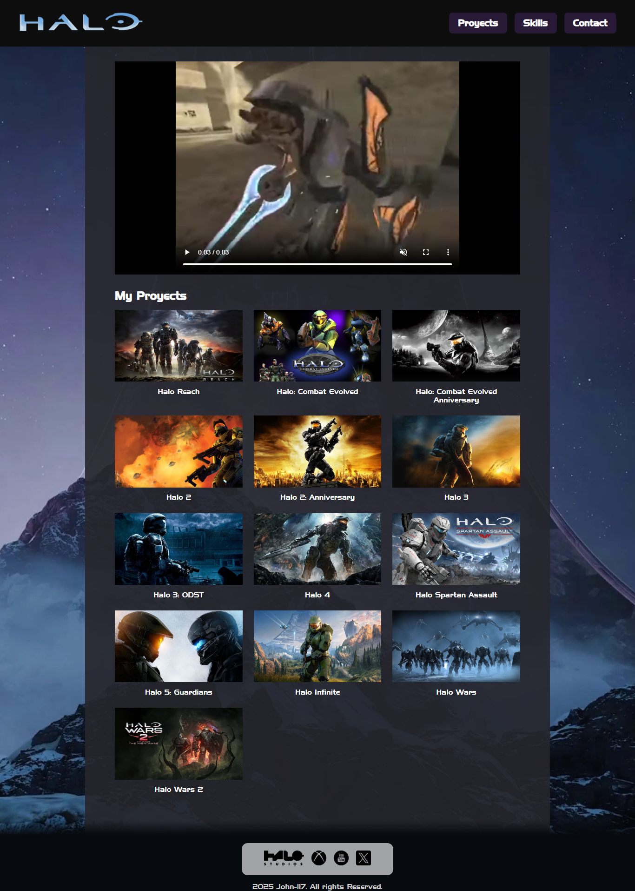
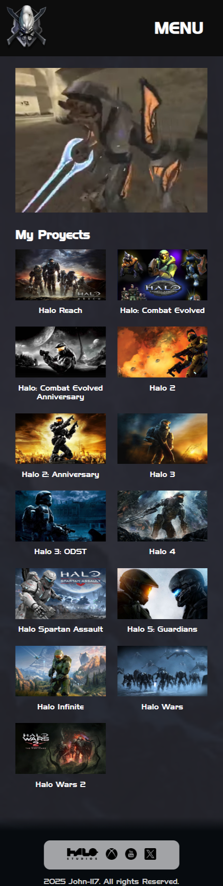
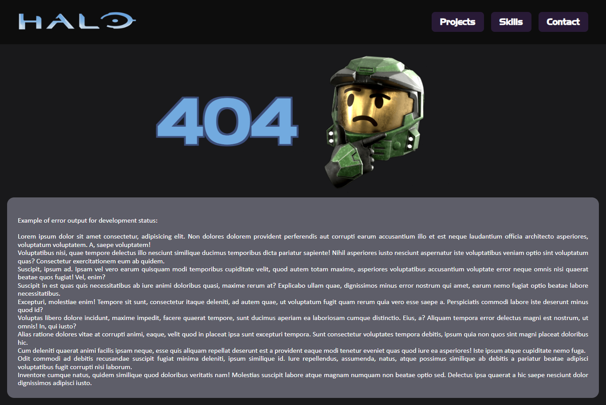

# Abgabeprojekt für CSS und HTML

**KeepCoding Projekte - Web 18**  
Die vollständige Liste der Repositories und Beschreibungen findest du in 📁 [repos-kc-web-18.md](https://github.com/pablo-sch/pablo-sch/blob/main/docs/repos-kc-web-18.md)

## Wähle deine Sprache

- 🇺🇸 [Englisch](README.md)
- 🇪🇸 [Spanisch](README.es.md)

<!-- ------------------------------------------------------------------------------------------- -->

## Projektziel

Das Hauptziel dieses Projekts ist die Entwicklung eines **persönlichen Portfolios** (oder eines Portfolios einer fiktiven Figur), wobei das im Unterricht erlernte Wissen angewendet wird. Ziel ist es, eine interaktive und optisch ansprechende Präsentation zu erstellen, die die Fähigkeiten und Projekte unserer gewählten Figur zeigt, unter Verwendung der im Kurs behandelten Technologien und Best Practices.

<!-- ------------------------------------------------------------------------------------------- -->

## Erlerntes und Angewandtes Wissen

- Umsetzung von strukturiertem **HTML** und dessen Interaktion mit dem **DOM**, ergänzt durch **CSS**-Stilregeln.
- Korrekte Verwendung der **semantischen** HTML-Tags in Kombination mit CSS-Regeln zur Verbesserung von Zugänglichkeit und Performance.
- Entwicklung von **Media Queries**, um ein **responsives** Design zu gewährleisten, das sich an verschiedene Bildschirmgrößen anpasst.
- Erstellung von dynamischen **Animationen** und **Übergängen** mit **CSS**, um das Benutzererlebnis zu verbessern.
- Individualisierung von Animationen mittels **Keyframes**, um einzigartige visuelle Effekte zu erzielen.
- Gestaltung eines **responsiven Layouts** mit Hilfe von **CSS Grids** für eine flexible und skalierbare Struktur.
- Anwendung einer klaren **CSS-Hierarchie**, um ein konsistentes und gut organisiertes Design sicherzustellen.
- Analyse des Verhaltens verschiedener **HTML-Tags** und deren Zusammenspiel mit **CSS** zur Optimierung der Inhaltsdarstellung.
- Implementierung von **Eingabefeldern** mit effizienter **Validierung**, um die Benutzerinteraktion mit Formularen sicherzustellen.
- Einbindung von **Links** zur Navigation zu externen Websites und zur Verbesserung der Zugänglichkeit.
- Gewährleistung von **sauberem und kohärentem Code**, mit einer organisierten Struktur zur Vereinfachung von Wartung und Erweiterung.

<!-- ------------------------------------------------------------------------------------------- -->

## Projektdetails

- Ein **Header** muss erstellt werden, in dem die Links einen sanften `hover`-Übergang aufweisen. Diese Links sind in der mobilen Version nicht erforderlich.
- Ein Abschnitt mit einer **Über uns**-Beschreibung und unseren Fähigkeiten, dargestellt durch **Fortschrittsbalken**, die mit **CSS** animiert werden.
- Ein **Banner** mit einem Hintergrundbild. Auf mobilen Geräten soll ein anderes Bild angezeigt werden (über **Media Queries** oder **Responsive Images**).
- Ein Kontaktformular mit **Eingabefeldern**. Alle Felder sollen korrekte Typen und HTML-Validierung enthalten:
  - **Vorname**, **Nachname**, **Telefonnummer** (Pflichtfelder).
  - **Radio Button**, um die Frage zu beantworten: „Wie hast du mich kennengelernt?“ (Pflichtfeld):
    - Universität
    - Keepcoding Kick-off
    - Schule
    - Auf GitHub
  - **GitHub-Tag** (Regulärer Ausdruck `^@[^\s]+` für die Validierung — `@username`).
  - **Textarea** für zusätzliche Informationen (max. 180 Zeichen) (Pflichtfeld).
  - **Checkbox** zur Anmeldung für den **Newsletter**.
  - **Speichern**- und **Zurücksetzen**-Buttons.
- Ein **Footer** mit externen Links zu unseren sozialen Netzwerken.
- Eine neue Seite mit einem **Video**, das beim Laden der Seite automatisch abgespielt wird und mit einer **fadeIn**-Animation erscheint.
- Eine neue Seite mit einem **Grid**, das unsere Projekte darstellt.

### Optionale Ziele

- Erstellung eines Burger-Menüs nur mit CSS und einem Checkbox-Input, ganz ohne JavaScript.
- Deployment über GitHub Pages.
- Eigene 404-Seite.
- Eigene 500-Seite.

<!-- ------------------------------------------------------------------------------------------- -->

## Verwendete Technologien

### Sprachen

- **HTML**: Für die Strukturierung des Inhalts und Aufbau der Webseite.
- **CSS**: Für das Design und visuelle Erscheinungsbild, um ein attraktives und einheitliches Benutzererlebnis zu gewährleisten.

### Abhängigkeiten

Keine

<!-- ------------------------------------------------------------------------------------------- -->

## Installations- und Nutzungshinweise

### Software-Voraussetzungen

- **[Git](https://git-scm.com/downloads)** (getestet mit Version **2.47.1.windows.1**)
- **[Visual Studio Code](https://code.visualstudio.com/)** (getestet mit Version **1.99.0**)
- **Live Server** (VS Code addon, _optional_)

### Repository klonen

Projekt

```bash
   git clone https://github.com/pablo-sch/keepcoding-02-html-css.git
```

Demo


### Hinweise

Nach dem Klonen des Repositories öffne die Dateien `index.html`, `project.html`, `404.html` und `500.html` mit **Live Server**, um sie im Browser anzuzeigen.

<!-- ------------------------------------------------------------------------------------------- -->

## Projektvorschau

### Index-Ansicht



### Mobile Index-Ansicht



### Projektansicht



### Mobile Projektansicht



### 404-Ansicht



### Mobile 404-Ansicht


<!-- ------------------------------------------------------------------------------------------- -->

## Beiträge und Lizenzen

Dieses Projekt enthält keine externen Beiträge und steht unter keiner Lizenz.
